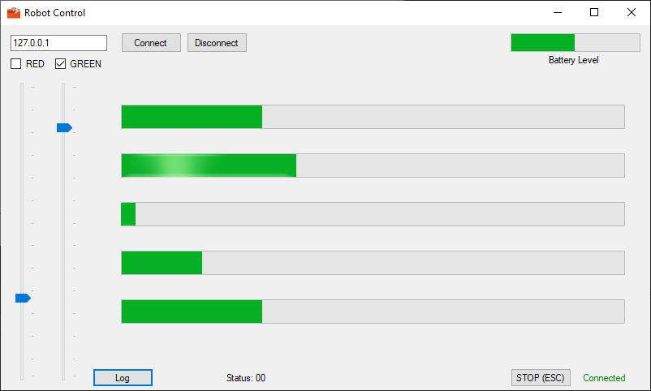
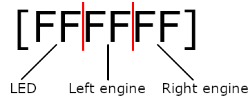

# MobileRobots



## The story behind the project
This application was my first attempt of creating a C# application that does a bit more than just computing output from two integers provided.

It doesn't really use OOP paradigm, as at the time of writing it, I wasn't aware of how to exactly use it, and I also wasn't aware of true C#/.NET potential and features back then. It doesn't follow good programming practices because of that either.

It was my answer to an university assignment I've got, where I was at free will which programming language I'll use. I picked C# since WPF looked fairly simple to use.

## Application idea
The idea was to create application that allowed the user to connect to a linefollower mobile robot using TCP socket and control it, while providing user a feedback from its sensors outputs.

Robot had 2 user controllable LEDs, 2 DC motors and 5 IR photorestistor sensors for reading the level of light reflection.

Application doesn't really provide the ability for robot to follow the line, since I spent lots of time figuring out C# quirks, but it does let the user control its LEDs, two DC motors independently and read it's feedback data (which were main requirements of this task).

The information about the robot was very limited, so everything like coding engine speeds, reading sensors data had to be figured out first, in order to use it.

With addition to it, I've implemented ability to use [keystrokes](https://github.com/kyelbek/MobileRobots/blob/master/MobileRobots/Form.cs#L342), in order to let user play with the mobile robot like it was a RC vehicle.

## Implementation

The communication module was pretty straightforward. The mobile robot was able to understand control frames sent to it with the following format:
<p align="center">
    
</p>

### First byte was responsible for two LEDs (green and red).

| Value  | LED states |
|--------|------------|
| 0x00   | Both OFF   |
| 0x01   | Green only |
| 0x02   | Red only   |
| 0x03   | Both ON    |

### Second and third byte were responsible for left and right engine speed and respectively.

Both of them were capable of rotating forward and backwards, and their speeds were in range of <-128;127>.

Because hexadecimal numbers can't be signed, signed numbers had to be converted to unsigned first (using [two's complement](https://github.com/kyelbek/MobileRobots/blob/master/MobileRobots/Form.cs#L258)), and then to hexadecimal string.

After getting all of the needed values, a complete control frame could've be created and sent to the robot.

After that, application was expecting a [feedback frame](https://github.com/kyelbek/MobileRobots/blob/master/MobileRobots/Form.cs#L217) to be sent back to it. That frame was similar in construction to control frame and it was in the following format:

```[00 7FAC 3A98 48A8 05F3 21C2 3A98]```

First byte was used to report a robot status.

| Value  | Status     |
|--------|------------|
| 0x00   | Good       |
| >=0x01 | Error      |

Any other value than 0x00 indicated that there is some kind of error (like overheated engine for example).

Next 2 bytes had encoded battery level information in them. Format unknown. At first I thought that it might be Li-Po voltage encoded in a float, but it wasn't. At the last iteration of the application it was being decoded as Int16, which made some sense by looking at the Battery level bar and RAW numbers, but it wasn't perfect solution for this reading.

Other bytes in pair of 2's had IR sensors readings encoded in them and they were in range of <0;20000>.

While it seemed to getting the more or less proper readings, progress bars weren't a good choice for visually displaying these values due to having smoothed effects, where the data was super jagged.

Since TCP socket data stream was handled in Timer thread, the controls in UI thread had to be updated using [invoker](https://github.com/kyelbek/MobileRobots/blob/master/MobileRobots/Form.cs#L245), to make sure that there won't be any data collisions.

After reading the data and updating the controls, another timer was started to count 200ms before sending the next control frame.

## Post Scriptum
This documentation might be incomplete due to fact that the project is very old and I didn't have access to hardware this software was working with, nor documentation for it at the time of writing it years later.

The only reason I created it anyways, is because I've decided that I want to keep my repositories clean and documented for future reference, even if the code is low quality from my early days of programming.
Some original (Polish) documentation can be found in the code itself in form of comments.

All of the readings on the screenshots were simulated using TCP Server emulator.